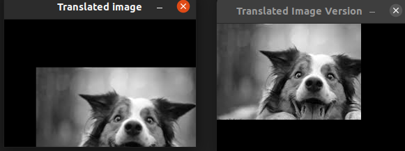

## TRANSLATION OF IMAGES

This is another type of Affine transformation where the image is shifted in the 2D plane through fixed distances on the x and y axes.

### Steps:
1. The image is first read and stored in the Mat format.
2. The distances in the x and y axes are defined through which the image has to be moved (tx and ty respectively).
3. The translation matrix which is a two dimensional matrix is created using these values. This matrix contains information for the image to be moved in the x and y directions.
4. Providing positive values for tx will shift the image to right and negative values will shift the image to the left. Similarly, positive values of ty will shift the image down while negative values will shift the image up.

*This is the original image*


*This is the translated image*



## Usage Instructions
1. Navigate to ```../Pixels_Seminar/4_cv_basics/2_playing_with_images/3_image_translation```
2. Open terminal in this folder
3. run   ```make clean``` to clean out any previous builds
4. type ```make build``` to build the executable
5. run ```make run```