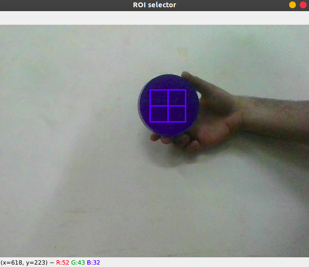
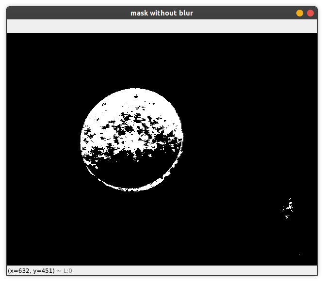
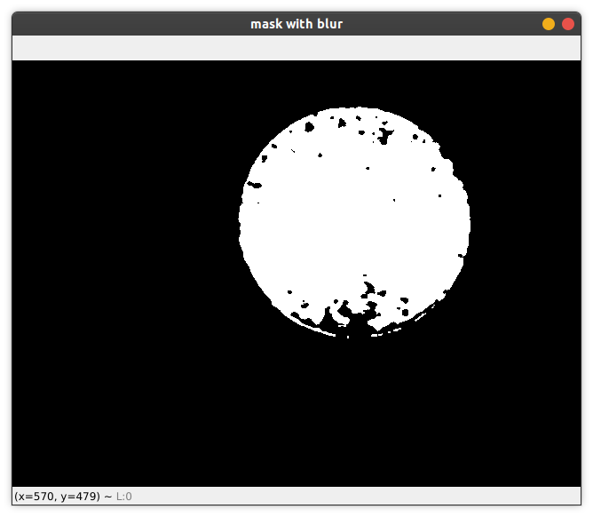
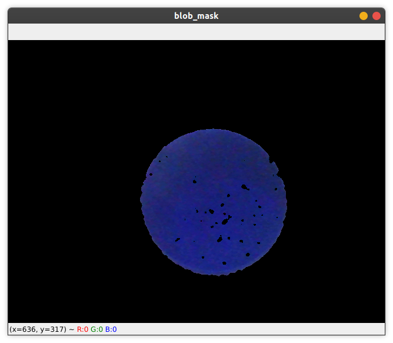
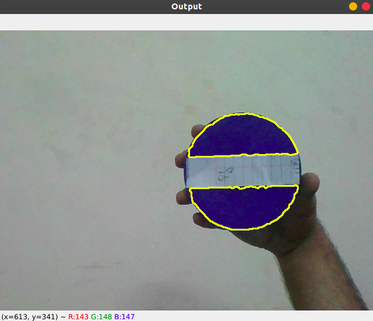

# Blob Detection

BLOB stands for Binary Large Object

Informally a blob is a region of an image in which some properties like intensity or color are approximately constant.

## Table of Contents

- [Preprocessing](#preprocessing)
    - [Choosing the color of blob](#choosing-the-color-of-blob)
    - [Converting to HSV and finding bounding values for mask](#converting-to-hsv-and-finding-bounding-values-for-mask)

- [Detecting the blob](#detecting-the-blob)
    - [Constructing mask for detecting blob](#constructing-mask-for-detecting-blob)
    - [Drawing the blob](#drawing-the-blob)
- [Usage](#usage)
- [Understanding the code](#understanding-the-code)


## Preprocessing

## Choosing the color of blob
* Reading the frame using video.read()
* Select a region in a frame of your color choice using selectROI()



## Converting to HSV and finding bounding values for mask
* Converting the frame to HSV format using cvtColor(... , ... , COLOR_BGR2HSV)

    * Why converting to HSV?  
        Since we are using the web cam the intensity and illumination of consecutive frame does not remain same.  
        Hence to find the color in range instead of particular color. HSV format is useful as H value denotes specific color and S, V can be used for illumination and intensity. 

        

* Extracting the select region from ROI
* Calculating the median H,S,V values from ROI
* Initializing the lower and upper bound for mask

---

# Detecting the blob
## Constructing mask for detecting blob
* Read the frame from video
* Convert from BGR to HSV
* Make a mask using inRange() by passing lower and upper bounds calculated earlier

    * What is a mask?  
    A mask is a binary image consisting of zero and non-zero values. If a mask is applied to another image of the same size, all pixels which are zero in the mask are set to zero in the output image. All others remain unchanged. 
   
  

* Blur the mask to remove the noise using medianBlur()  



* Placing mask over frame to find colored mask using bitwise_and()




## Drawing the blob
* Find the contour from the generated mask using findContours()

    * What is contour?  
    Contours can be explained simply as a curve joining all the continuous points (along the boundary), having same color or intensity. The contours are a useful tool for shape analysis and object detection and recognition

     
    
    
* Find the contour having the maximum area using contourArea()
* Draw the contour on the frame using drawContours()

## Usage

---

1. Navigate to ../Pixels_Seminar/4_cv_basics/8_blob_detection
2. Open terminal in this folder
3. run   ```make clean``` to clean out any previous builds
4. run ```make SRC=main.cpp link=src/blob_detection.cpp``` to build the executable
5. run ```./blob_detection```
6. You should now have an imshow window "Image" capturing a video. Press ```q```  to capture the desired frame.
7. Using the cursor, select your region of interest (ROI), which is a rectangular box
8. Press ```space``` or ```enter``` and you will see the "blob_mask" and "Output" windows.
9. Press ```x``` to exit

## Understanding the code

---

* The code below captures a video using the webcam and stores the video by the name 'frame'

```cpp
int main()
{
    VideoCapture video(0);
    int h = 0, s = 0, v = 0;
    while (video.isOpened())
    {
        Mat frame;
        video.read(frame);
        imshow("Image", frame);

```

---

* Pressing 'q' would select the frame at that instance.
* `selectROI()` allows you to select that part of the captured frame in which the blob exists (and has to be detected later).
* Next, convert the frame to hsv.
* obj_img is hsv image of the size of the selected ROI.

* Next, we want the median values of each of hue, saturation and value, of the <b>selected ROI</b>.

```cpp
 while (1)
    {
        if (waitKey(10) == 'q')
        {
            Rect bbox = selectROI("Image", frame, false, false);
            Mat hsv;
            cvtColor(frame, hsv, COLOR_BGR2HSV);
            Mat obj_img = hsv(Rect(bbox.x, bbox.y, bbox.width, bbox.height));
            tuple<double, double, double> medians = getMedianPixelValues(obj_img);
            h = get<0>(medians);
            s = get<1>(medians);
            v = get<2>(medians);
            break;
        }
    }
```

---

* We keep capturing the video via webcam until the program is running.
* The captured video is coverted to hsv
* Using the median values of h,s,v obtained in the previous section, we calculate the upper and lower bounds of each (for masking done later).

```cpp
    while (video.isOpened())
    {
        Mat frame;
        video.read(frame);

        // Converting to hsv
        Mat hsv;
        cvtColor(frame, hsv, COLOR_BGR2HSV);

        // Getting lower and upper bounds for h,s,v values
        Scalar lower(h - 5, max(0, s - 50), max(0, v - 50));
        Scalar upper(h + 5, min(s + 50, 255), min(v + 50, 255));

```
* We make a mask using `inRange()` function with the lower and upper scalars obatined.
* We blur the mask to remove noises. 
* Placing blurred mask over frame to find `bitwise_and()`.

```cpp
        // Masking
        Mat masked;
        inRange(hsv, lower, upper, masked);

        // Median Blur
        Mat blur;
        medianBlur(masked, blur, 5);

        // Performing bitwise_and using the 'blur' mask
        Mat blob_mask;
        bitwise_and(frame, frame, blob_mask, blur);

        imshow("blob_mask", blob_mask);
```

---

* Find the contour from the generated mask using `findContours()`
* Find the contour having the maximum area using `contourArea()`
* Draw the largest contour on the frame using `drawContours()`

```cpp
        // Find contours
        vector<vector<Point>> contours;
        vector<Vec4i> hierarchy;
        findContours(blur, contours, hierarchy, RETR_TREE, CHAIN_APPROX_SIMPLE);

        // Find largest contour
        int idx = 0;
        double current_max = 0;
        int counter = 0;

        for (const auto &n : contours)
        {
            double area = contourArea(n);
            if (area > current_max)
            {
                current_max = area;
                idx = counter;
            }
            counter++;
        }
        
        // Draw the largest contour detected
        drawContours(frame, contours, idx, Scalar(0, 255, 255), 2);
        imshow("Output", frame);

        if (waitKey(10) == 'x')
        {
            destroyAllWindows();
            video.release();
            break;
        }
    }

    return 0;
}
```
