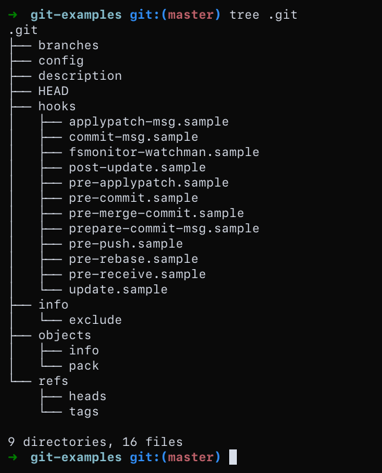
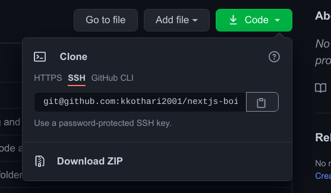
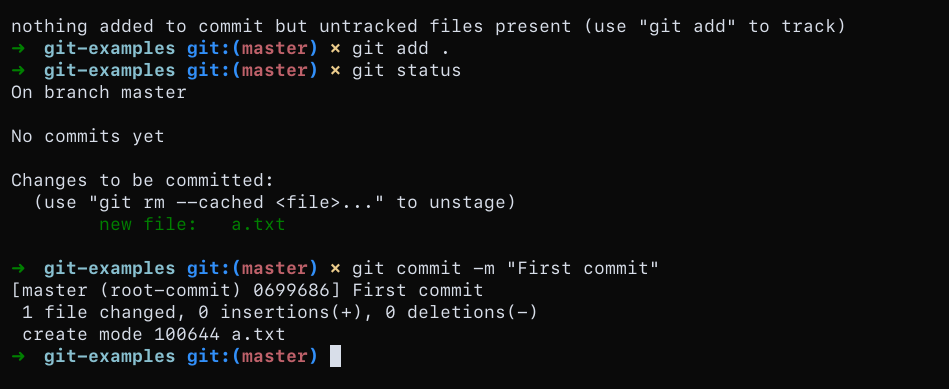
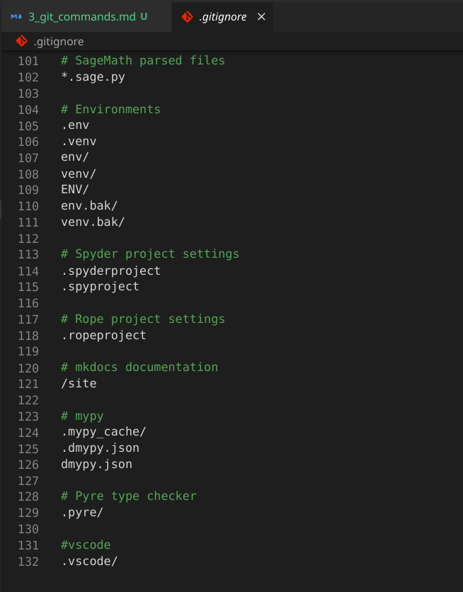

# Git Commands
Now that you know what the basics of git are, we will now be looking at git commands that we use regularly, while collaborating with others on a project.

## Setting up a git repository
```
git init / git clone
```
### git init
To create a new repo, you'll use the `git init` command. `git init` is a one-time command you use during the initial setup of a new repo. Executing this command will create a new `.git` subdirectory in your current working directory. This will also create a new master branch.




### git clone
If a project has already been set up in a central repository, the clone command is the most common way for users to obtain a local development clone. Like `git init`, cloning is generally a one-time operation. Once a developer has obtained a working copy, all version control operations are managed through their local repository.




### Bare vs. cloned repositories
If you used git clone to set up your local repository, your repository is already configured for remote collaboration. git clone will automatically configure your repo with a remote pointed to the Git URL you cloned it from. This means that once you make changes to a file and commit them, you can git push those changes to the remote repository.

If you used git init to make a fresh repo, you'll have no remote repo to push changes to. A common pattern when initializing a new repo is to go to a hosted Git service like Bitbucket and create a repo there. The service will provide a Git URL that you can then add to your local Git repository and git push to the hosted repo. Once you have created a remote repo with your service of choice you will need to update your local repo with a mapping. We discuss this process in the Configuration & Set Up guide below.


<br>
<br>

## Saving changes
```
git add / git status / git commit / .gitignore
```
The traditional software expression of "saving" is synonymous with the Git term "committing". A commit is the Git equivalent of a "save". Traditional saving should be thought of as a file system operation that is used to overwrite an existing file or write a new file. Alternatively, Git committing is an operation that acts upon a collection of files and directories.

The commands: `git add` , `git status` , and `git commit` are all used in combination to save a snapshot of a Git project's current state.

A Git repository can be configured to ignore specific files or directories. This will prevent Git from saving changes to any ignored content.


<br>
<br>

### git status
Can be used to see the status of the various files if they have to be changed in any way. You can even check what stage they are in using this command.

<br>
<br>

### git add
The git add command adds a change in the working directory to the staging area. It tells Git that you want to include updates to a particular file in the next commit. However, git add doesn't really affect the repository in any significant way—changes are not actually recorded until you run `git commit`.

#### What is the staging area?
Instead of committing all of the changes you've made since the last commit, the stage lets you group related changes into highly focused snapshots before actually committing it to the project history.
#### Usage
```
git add filename

OR

git add .
```


<br>
<br>

### git commit
The git commit command captures a snapshot of the project's currently staged changes. Committed snapshots can be thought of as “safe” versions of a project—Git will never change them unless you explicitly ask it to. Prior to the execution of `git commit` , The `git add` command is used to promote or 'stage' changes to the project that will be stored in a commit. These two commands `git commit` and `git add` are two of the most frequently used.



At a high-level, Git can be thought of as a timeline management utility. Commits are the core building block units of a Git project timeline. Commits can be thought of as snapshots or milestones along the timeline of a Git project. Commits are created with the `git commit` command to capture the state of a project at that point in time. Git Snapshots are always committed to the local repository.

<br>
<br>

### .gitignore
Git sees every file in your working copy as one of three things:

- tracked - a file which has been previously staged or committed
- untracked - a file which has not been staged or committed or
- ignored - a file which Git has been explicitly told to ignore.

Ignored files are usually build artifacts and machine generated files that can be derived from your repository source or should otherwise not be committed.

Ignored files are tracked in a special file named .gitignore that is checked in at the root of your repository. **There is no explicit git ignore command**: instead the .gitignore file must be edited and committed by hand when you have new files that you wish to ignore.

